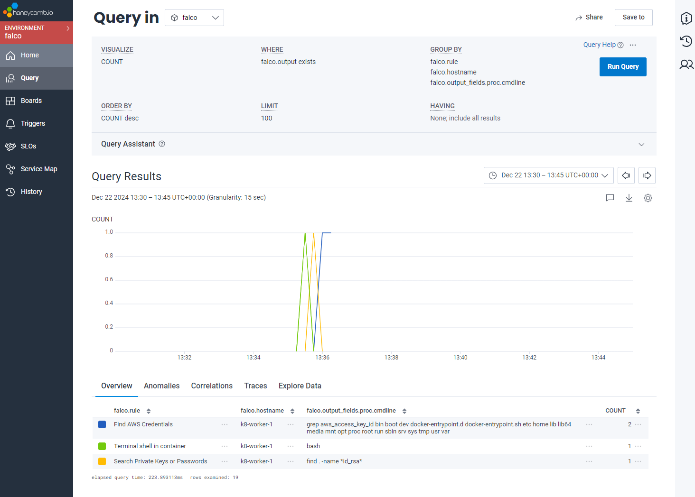
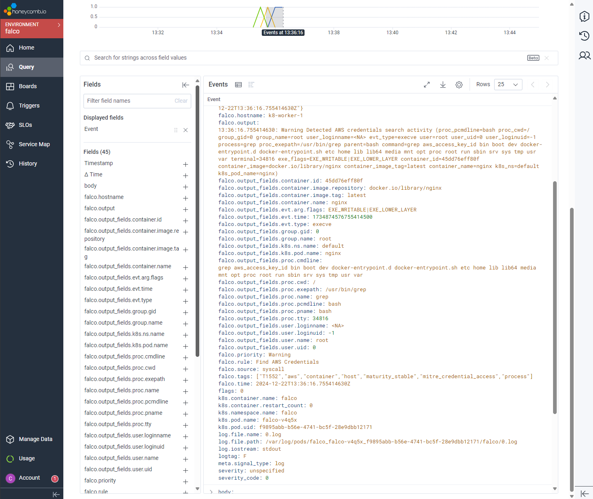

# K8 Falco Demo

This is a simple demo to show how [Falco](https://falco.org/) can be used to monitor Kubernetes clusters. In the demo 
we will deploy Falco to a Kubernetes cluster, running falco as a daemonset. We will then deploy a simple 
nginx pod and perform some actions that will trigger falco rules. Lastly we will use OpenTelemetry to send the logs to
a backend for analysis. In this example we will use [honeycomb](https://www.honeycomb.io/).

## Installing Falco

We will use helm to install falco. We will also set a number of overrides for the deployment. 

```shell
helm repo add falcosecurity https://falcosecurity.github.io/charts
helm repo update
helm install --replace falco --namespace falco --create-namespace --set tty=true falcosecurity/falco --set falco.json_output=true
```

We are overriding the following values:
* tty=true - Needed to flush Falco logs as soon as they are emitted.
* falco.json_output=true - Falco will output alert messages and rules file loading/validation results in JSON format

Checking that the falco pods are running as a daemonset:

```shell
$ k get daemonsets.apps -n falco falco
NAME    DESIRED   CURRENT   READY   UP-TO-DATE   AVAILABLE   NODE SELECTOR   AGE
falco   3         3         3       3            3           <none>          14h
```

```shell
$ k get pods -n falco -l app.kubernetes.io/name=falco -o wide
NAME          READY   STATUS    RESTARTS   AGE     IP           NODE           NOMINATED NODE   READINESS GATES
falco-ftdlp   2/2     Running   0          4h35m   10.0.2.39    k8-worker-2    <none>           <none>
falco-kv6pk   2/2     Running   0          4h34m   10.0.0.134   k8-control-1   <none>           <none>
falco-v4q5x   2/2     Running   0          4h36m   10.0.1.89    k8-worker-1    <none>           <none>
```

## The Nginx Pod

We will deploy an nginx pod to the cluster. We will then exec into the pod and perform some actions that will trigger
falco rules.

```shell
$ k run nginx --image nginx:latest
pod/nginx created
```

Even logging into the pod will trigger a falco rule. Once in the pod we will run a few commands that will trigger falco
rules.

```shell
$ k exec nginx -it -- /bin/bash
root@nginx:/# find . -name "*id_rsa*" 2>/dev/null
root@nginx:/# grep "aws_access_key_id" * 2>/dev/null
```

We check which node the nginx workload is running on. In this case we can see its on k8-worker-1. So we tail the logs
from the falco pod running on that node.

```shell
$ k get pods -o wide
NAME    READY   STATUS    RESTARTS   AGE     IP           NODE          NOMINATED NODE   READINESS GATES
nginx   1/1     Running   0          2m58s   10.0.1.197   k8-worker-1   <none>           <none>

$ k get pods -n falco -o wide
NAME                    READY   STATUS    RESTARTS   AGE     IP           NODE           NOMINATED NODE   READINESS GATES
falco-ftdlp             2/2     Running   0          4h41m   10.0.2.39    k8-worker-2    <none>           <none>
falco-kv6pk             2/2     Running   0          4h40m   10.0.0.134   k8-control-1   <none>           <none>
falco-v4q5x             2/2     Running   0          4h41m   10.0.1.89    k8-worker-1    <none>           <none>
```

## Falco Logs
We can use kubectl to tail the logs from the falco pod running on the node that the nginx pod is running on.

```shell
$ k logs -n falco falco-v4q5x -c falco --tail=5
{"hostname":"k8-worker-1","output":"13:35:40.929908828: Notice A shell was spawned in a container with an attached terminal (evt_type=execve user=root user_uid=0 user_loginuid=-1 process=bash proc_exepa
th=/usr/bin/bash parent=runc command=bash terminal=34816 exe_flags=EXE_WRITABLE|EXE_LOWER_LAYER container_id=45dd76eff80f container_image=docker.io/library/nginx container_image_tag=latest container_nam
e=nginx k8s_ns=default k8s_pod_name=nginx)","output_fields":{"container.id":"45dd76eff80f","container.image.repository":"docker.io/library/nginx","container.image.tag":"latest","container.name":"nginx",
"evt.arg.flags":"EXE_WRITABLE|EXE_LOWER_LAYER","evt.time":1734874540929908828,"evt.type":"execve","k8s.ns.name":"default","k8s.pod.name":"nginx","proc.cmdline":"bash","proc.exepath":"/usr/bin/bash","pro
c.name":"bash","proc.pname":"runc","proc.tty":34816,"user.loginuid":-1,"user.name":"root","user.uid":0},"priority":"Notice","rule":"Terminal shell in container","source":"syscall","tags":["T1059","container","maturity_stable","mitre_execution","shell"],"time":"2024-12-22T13:35:40.929908828Z"}

{"hostname":"k8-worker-1","output":"13:35:59.412045659: Warning Grep private keys or passwords activities found (evt_type=execve user=root user_uid=0 user_loginuid=-1 process=find proc_exepath=/usr/bin/
find parent=bash command=find . -name *id_rsa* terminal=34816 exe_flags=EXE_WRITABLE|EXE_LOWER_LAYER container_id=45dd76eff80f container_image=docker.io/library/nginx container_image_tag=latest containe
r_name=nginx k8s_ns=default k8s_pod_name=nginx)","output_fields":{"container.id":"45dd76eff80f","container.image.repository":"docker.io/library/nginx","container.image.tag":"latest","container.name":"ng
inx","evt.arg.flags":"EXE_WRITABLE|EXE_LOWER_LAYER","evt.time":1734874559412045659,"evt.type":"execve","k8s.ns.name":"default","k8s.pod.name":"nginx","proc.cmdline":"find . -name *id_rsa*","proc.exepath
":"/usr/bin/find","proc.name":"find","proc.pname":"bash","proc.tty":34816,"user.loginuid":-1,"user.name":"root","user.uid":0},"priority":"Warning","rule":"Search Private Keys or Passwords","source":"syscall","tags":["T1552.001","container","filesystem","host","maturity_stable","mitre_credential_access","process"],"time":"2024-12-22T13:35:59.412045659Z"}

{"hostname":"k8-worker-1","output":"13:36:16.755414630: Warning Detected AWS credentials search activity (proc_pcmdline=bash proc_cwd=/ group_gid=0 group_name=root user_loginname=<NA> evt_type=execve us
er=root user_uid=0 user_loginuid=-1 process=grep proc_exepath=/usr/bin/grep parent=bash command=grep aws_access_key_id bin boot dev docker-entrypoint.d docker-entrypoint.sh etc home lib lib64 media mnt 
opt proc root run sbin srv sys tmp usr var terminal=34816 exe_flags=EXE_WRITABLE|EXE_LOWER_LAYER container_id=45dd76eff80f container_image=docker.io/library/nginx container_image_tag=latest container_na
me=nginx k8s_ns=default k8s_pod_name=nginx)","output_fields":{"container.id":"45dd76eff80f","container.image.repository":"docker.io/library/nginx","container.image.tag":"latest","container.name":"nginx"
,"evt.arg.flags":"EXE_WRITABLE|EXE_LOWER_LAYER","evt.time":1734874576755414630,"evt.type":"execve","group.gid":0,"group.name":"root","k8s.ns.name":"default","k8s.pod.name":"nginx","proc.cmdline":"grep a
ws_access_key_id bin boot dev docker-entrypoint.d docker-entrypoint.sh etc home lib lib64 media mnt opt proc root run sbin srv sys tmp usr var","proc.cwd":"/","proc.exepath":"/usr/bin/grep","proc.name":
"grep","proc.pcmdline":"bash","proc.pname":"bash","proc.tty":34816,"user.loginname":"<NA>","user.loginuid":-1,"user.name":"root","user.uid":0},"priority":"Warning","rule":"Find AWS Credentials","source":"syscall","tags":["T1552","aws","container","host","maturity_stable","mitre_credential_access","process"],"time":"2024-12-22T13:36:16.755414630Z"}
```

We can see 3 events that have been triggered by the actions we performed in the nginx pod. These are coming from the 
default rules in the falco helm deployment. You can add additional rules or disable rules as needed.

## OpenTelemetry

So we can now see that falco is detecting events in the cluster. However, we don't want to have to tail logs from each
node to see what is happening. We can use OpenTelemetry to send the logs to a backend for analysis. In this example we
will use honeycomb.

The OpenTelemetry Operator is a Kubernetes operator that manages the lifecycle of OpenTelemetry components in a Kubernetes
cluster. The OpenTelemetry Operator is a Helm chart that can be installed into a Kubernetes cluster using Helm. We will 
install it with the following command:

```shell
helm repo add open-telemetry https://open-telemetry.github.io/opentelemetry-helm-charts
helm install opentelemetry-operator open-telemetry/opentelemetry-operator --namespace otel --create-namespace \
  --set "manager.collectorImage.repository=otel/opentelemetry-collector-k8s" \
  --set admissionWebhooks.certManager.enabled=false \
  --set admissionWebhooks.autoGenerateCert.enabled=true
```

I won't go into the details of the OpenTelemetry setup here. You can find more information in the 
[OpenTelemetry](https://opentelemetry.io/docs/kubernetes/helm/operator/) documentation.

We can use the OpenTelemetry Operators CRD to create a new OpenTelemetry Collector instance. You can view the manifest in 
the file [otel-collector.yaml](./otel-collector.yaml). 

The collector will be configured with a filelog receiver to collect logs from the falco pods. In order for this to work
we create volumes and volume mounts to mount the container logs from the host into the collector pod for reading. This 
is because the falco pods write their output to STDOUT. The collector pod needs to be able to read this from the host.

We will also configure an OTLP exporter to ship these logs to HoneyComb. We will need to set the HoneyComb API key as a
secret in the cluster. We can then reference this in the OTLP exporter configuration. We also set the dataset
as a header.

Lastly we are using the [container-parser](https://opentelemetry.io/blog/2024/otel-collector-container-log-parser/) 
operator to parse the logs from the falco pods. We also json_parse the body into a new attribute called falco. This 
allows us to query the logs in honeycomb using the falco attribute.

We need to apply the CRD to the cluster:

```shell
```shell
kubectl apply -f otel-honeycomb-apikey
```

We can then use the honeycomb UI to query the logs or explore the data and see the events that have been triggered by falco.


